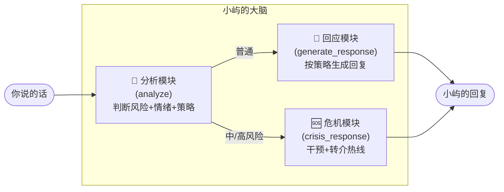
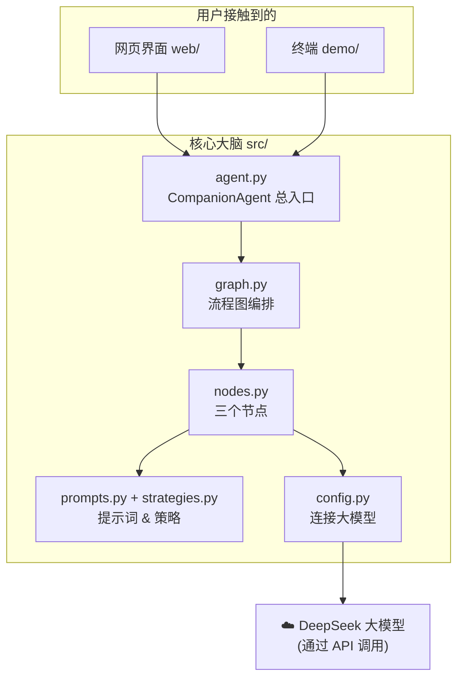

# 第 1 章 · 项目全景与心智模型

## 1.1 这个项目到底做什么？

「小屿」是一个**面向学生的心理陪伴聊天智能体**。你可以像和朋友发消息一样跟它聊天，它会：

1. **听懂你的情绪**（你是焦虑、孤独，还是难过？程度多深？）
2. **判断有没有心理风险**（普通倾诉，还是出现了"活着没意义"这种危险信号？）
3. **挑一个合适的沟通策略**（是先共情安慰，还是温和地问一句引导你多说？）
4. **生成一句有温度的回应**（不说教、不评判、像个耐心的学长学姐）
5. 一旦发现**危机**，立刻切换到"危机干预"模式，稳住情绪并给出**求助热线**。

它不是"更聪明的搜索框"，而是一个**有流程、有策略、有安全底线**的对话系统。

## 1.2 先建立一个心智模型（最重要）

很多新手一上来就钻代码，结果迷路。请先记住这张"**大脑分工图**"：



**关键点**：每来一句话，一定**先经过"分析模块"这道闸门**，再决定走"普通回应"还是"危机干预"。这就是"安全阀"的思想——先评估安全，再说话。

## 1.3 项目目录结构（图）

```
mental-health-companion-agent/
│
├── src/                    ← 🧠 智能体核心（最重要，第3章重点讲）
│   ├── config.py           ← 配置：怎么连 DeepSeek 大模型
│   ├── strategies.py       ← 6 个"沟通策略"的定义（策略库）
│   ├── prompts.py          ← 给大模型的"提示词"：角色设定、安全边界、各种指令
│   ├── state.py            ← "状态"：一轮对话里要记住哪些信息
│   ├── nodes.py            ← 三个"节点"：分析 / 普通回应 / 危机回应
│   ├── graph.py            ← 把节点连成一张"流程图"（LangGraph）
│   └── agent.py            ← 对外的总开关：CompanionAgent，负责聊天+记日志
│
├── demo/                   ← 🎬 演示
│   ├── scenarios.py        ← 3 个预设剧本（学业焦虑/孤独/危机）
│   └── demo.py             ← 自动演示 & 终端交互
│
├── evaluation/             ← 📊 评测（打分）
│   ├── rubric.py           ← 评分标准（5 个维度 + 危机安全项）
│   └── evaluate.py         ← 用大模型当"评委"给回复打分
│
├── web/                    ← 🌐 网页可视化界面
│   ├── server.py           ← 后端（FastAPI）
│   └── static/index.html   ← 前端页面（聊天 + 实时分析面板）
│
├── docs/                   ← 📄 文档（含你正在读的这份教程）
├── logs/                   ← 📝 每轮对话的记录（自动生成的 .jsonl）
│
├── .env                    ← 🔑 密钥配置（DeepSeek API Key，不上传）
├── requirements.txt        ← 依赖清单（项目用到哪些第三方库）
└── README.md               ← 项目说明书
```

一个好习惯：**看一个新项目，先看目录结构和 README，建立"地图"，再钻具体文件。**

## 1.4 各部分怎么协作（分层图）



- **用户层**（网页 / 终端）：负责收你的输入、显示回复。
- **核心层**（`src/`）：真正的"大脑"，编排流程、组织提示词。
- **模型层**（DeepSeek）：真正"生成文字"的地方，在云端，我们通过网络 API 调用它。

## 1.5 数据是怎么流动的？（一次对话的极简版）

```
你："最近好累，努力都没用"
   │
   ▼
① analyze 分析 → { 风险: 低, 情绪: 无力(4/5), 策略: 共情与情感确认 }
   │
   ▼ （低风险 → 走普通路径）
② generate_response → 把"共情策略的要求"+"你的话"发给 DeepSeek
   │
   ▼
③ DeepSeek 返回："听起来你已经撑了很久了……"
   │
   ▼
你看到回复；同时这一轮的分析结果显示在网页右侧面板 / 写进 logs/
```

## 1.6 本章小结

- 记住"分析 → 分流（普通/危机）→ 回应"这条主线。
- 记住目录结构：`src/` 是大脑，`web/`、`demo/` 是外壳，DeepSeek 在云端。
- 下一章开始，我们逐个拆解用到的技术。

➡️ 下一章：[第 2 章 · 技术栈详解](02-技术栈详解.md)
