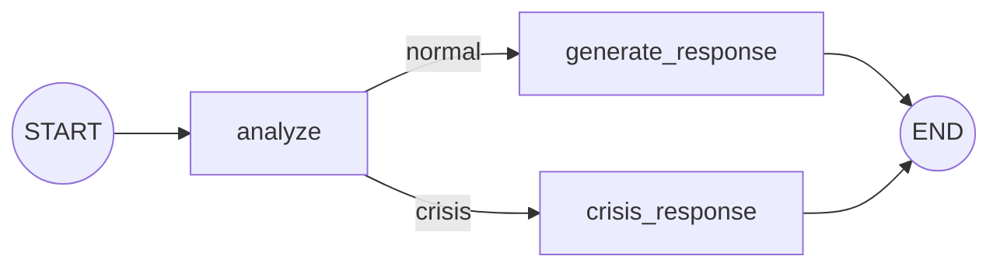
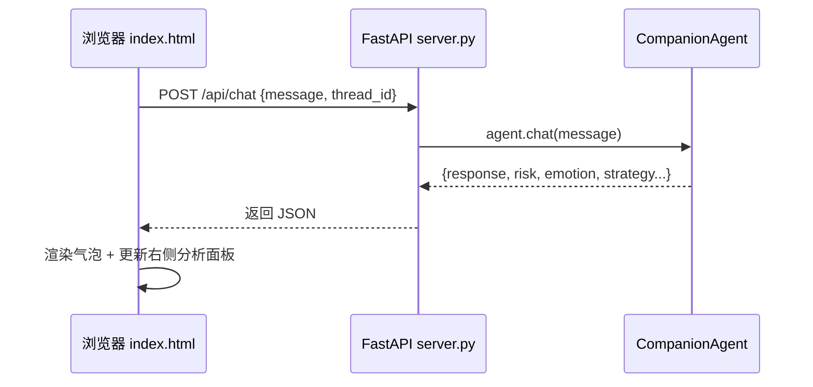

# 第 2 章 · 技术栈详解

本章把项目用到的每一项技术都讲清楚：**它是什么、为什么需要它、在本项目哪里用到**。不需要死记，理解思路即可。

---

## 2.1 Python 工程基础

### 2.1.1 虚拟环境（venv）—— 给项目一个"独立房间"

不同项目需要的第三方库版本可能冲突。**虚拟环境**就是给每个项目单独一间"房间"，里面装自己的库，互不打架。

```bash
python3 -m venv .venv        # 创建虚拟环境，生成 .venv/ 文件夹
.venv/bin/pip install ...    # 用这个房间里的 pip 装库
.venv/bin/python ...         # 用这个房间里的 python 跑代码
```

本项目所有依赖都装在 `.venv/` 里。这也是为什么运行命令都写成 `.venv/bin/python`。

> 💡 IDE 有时会提示"包未安装"，那是因为 IDE 选的解释器不是我们的 `.venv`——不影响命令行运行。

### 2.1.2 依赖清单 requirements.txt

一行一个库，记录项目需要什么。别人拿到项目，一句 `pip install -r requirements.txt` 就能装齐。

```
langgraph>=0.2.0        # 流程编排
langchain-openai>=0.1.0 # 调用 OpenAI 兼容大模型（DeepSeek）
langchain-core>=0.2.0   # 消息类型等基础件
python-dotenv>=1.0.0    # 读取 .env 配置
certifi / httpx         # 网络与证书
fastapi / uvicorn       # 网页后端
```

### 2.1.3 模块（module）、包（package）与 `import`

- 一个 `.py` 文件 = 一个**模块**。
- 一个含 `__init__.py` 的文件夹 = 一个**包**，可以被 `import`。
- `from .config import chat_llm` 里的**那个点 `.`** 表示"从当前包里导入"（相对导入）。

这就是 `src/`、`demo/`、`web/` 里都有个空 `__init__.py` 的原因——让它们成为"可导入的包"。

### 2.1.4 会用到的几个 Python 语法糖

| 语法 | 是什么 | 本项目哪里用 |
|------|--------|-------------|
| **类型注解** `def f(x: str) -> int:` | 标注参数/返回值类型，只是"说明"，不强制 | 几乎所有函数 |
| **`TypedDict`** | 规定"这个字典应该有哪些键、值是什么类型" | `state.py` 定义对话状态 |
| **`@dataclass`** | 快速定义"只用来装数据的类"，省去手写 `__init__` | `strategies.py` 的 `Strategy` |
| **`@lru_cache`** | 装饰器：把函数结果缓存起来，同样参数不重复计算 | `config.py` 缓存大模型客户端 |
| **f-string** `f"你好{name}"` | 在字符串里直接插入变量 | 到处都是 |

> **装饰器**（`@xxx` 写在函数上面那行）你可以理解为"给函数套一层额外能力"。`@lru_cache` 就是套上"记忆"能力：第一次算完记住，下次直接返回。

---

## 2.2 大模型（LLM）基础 —— 本项目的"发动机"

### 2.2.1 什么是 LLM？

LLM = Large Language Model，大语言模型（如 DeepSeek、GPT、Claude）。你可以把它想成一个**超级"文字接龙"引擎**：给它一段文字，它预测"接下来最合理的文字"，从而实现问答、聊天、写作。

**我们不训练它，只调用它**——就像你不造发电厂，只插上插座用电。

### 2.2.2 几个必须懂的概念

| 概念 | 通俗解释 |
|------|---------|
| **Prompt（提示词）** | 你发给模型的输入文字。提示词写得好不好，直接决定输出质量。 |
| **Token（词元）** | 模型处理文字的最小单位。约等于"字/词的碎片"。中文大致 1 字 ≈ 1~2 token。API 按 token 计费。 |
| **上下文窗口** | 模型一次能"看"的最大 token 数。太长的对话要裁剪（本项目 `_history_text` 只取最近 8 条就是这个原因）。 |
| **Temperature（温度）** | 控制输出的"随机/创造性"。0 = 最稳定、每次几乎一样；越高越发散、有创意。 |
| **角色（role）** | 对话消息分三种角色：`system`（系统设定）、`user`（用户）、`assistant`（模型自己）。 |

### 2.2.3 三种消息角色（超级重要）

和大模型对话，其实是发一个"消息列表"，每条消息有角色：

```
[
  {role: "system",    content: "你是小屿，一个温和的心理陪伴者……"}   ← 设定人设/规则
  {role: "user",      content: "最近好累"}                          ← 用户说的
  {role: "assistant", content: "听起来你撑了很久……"}                ← 模型上一轮的回复
  {role: "user",      content: "嗯，是的"}                          ← 用户新的话
]
```

- **system**：定"人设和规矩"，模型会全程遵守。本项目的**角色设定、安全边界、策略要求**都放在 system 里。
- **user / assistant** 交替出现，构成"对话历史"，让模型记住上下文。

### 2.2.4 Temperature 在本项目的巧用

本项目用了**两种温度**（见 `config.py`）：

- **分析模块用 `temperature=0`**：判断风险/情绪/策略要**稳定、可复现**，不能今天判低风险、明天判高风险。
- **回应模块用 `temperature=0.7`**：生成安慰的话要**自然、有温度**，太死板就像机器人了。

### 2.2.5 JSON 模式（结构化输出）

普通聊天模型输出的是"一段话"，但分析模块需要机器能读的**结构化数据**（风险等级、情绪……）。于是我们让模型开启 **JSON 模式**，强制它只输出如下格式：

```json
{"risk_level":"low","emotion":"焦虑","intensity":4,"strategy":"empathy","strategy_reason":"..."}
```

程序再用 `json.loads()` 把这段文字变成 Python 字典，直接取值。这是"让大模型输出可被程序使用"的关键技巧。

---

## 2.3 API 与 DeepSeek

### 2.3.1 什么是 API？

API = 应用程序接口。简单说：**你按约定格式发一个网络请求，对方按约定格式回你数据。** DeepSeek 把大模型放在云端，开放一个 API，我们发消息、它回文字。

- **API Key**（`sk-xxxx`）= 你的"身份令牌 + 计费账户"。**绝不能泄露/上传到公开仓库**（本项目把它放在 `.env` 并用 `.gitignore` 排除）。

### 2.3.2 "OpenAI 兼容接口"是什么意思？

OpenAI 定义了一套调用大模型的"标准格式"，被业界广泛采用。DeepSeek 也**兼容这套格式**。好处是：我们可以用为 OpenAI 写的工具库（`langchain-openai`）直接调用 DeepSeek，只需把"服务器地址"改成 DeepSeek 的：

```python
ChatOpenAI(
    model="deepseek-chat",
    api_key="sk-...",
    base_url="https://api.deepseek.com",   # ← 关键：指向 DeepSeek
)
```

---

## 2.4 LangChain（core）—— 大模型的"标准适配器"

LangChain 是一套帮你"搭大模型应用"的工具库。本项目只用到它最基础的两块：

### 2.4.1 消息类（Message）

把 2.2.3 的三种角色包装成 Python 对象，用起来更清爽：

```python
from langchain_core.messages import SystemMessage, HumanMessage, AIMessage
SystemMessage(content="你是小屿…")   # 对应 role=system
HumanMessage(content="最近好累")      # 对应 role=user
AIMessage(content="听起来…")          # 对应 role=assistant
```

### 2.4.2 `ChatOpenAI` 与 `.invoke()`

`ChatOpenAI` 是"大模型客户端"。`.invoke(消息)` 就是"发出去、拿回复"：

```python
llm = ChatOpenAI(model="deepseek-chat", ...)
reply = llm.invoke([SystemMessage(...), HumanMessage("你好")])
print(reply.content)   # 模型回复的文字
```

记住：**`.invoke()` = 真正花钱、走网络、调用大模型的那一下。** 本项目每轮对话调用 2 次（分析 1 次 + 生成 1 次）。

---

## 2.5 LangGraph —— 本项目的"流程编排大脑" ⭐

这是本项目最核心的技术，务必理解。

### 2.5.1 为什么需要它？

如果只是"用户说一句→模型回一句"，一个函数就够了，不需要 LangGraph。但本项目要做**多步骤、有分支**的流程：

> 先分析 → 判断风险 → **如果危机走 A 路，否则走 B 路** → 生成回复

这种"**有状态、有分支、多节点**"的流程，用 LangGraph 来编排最清晰。你可以把它理解为"**给 AI 应用画流程图，并且这张图能真的运行**"。

### 2.5.2 四个核心概念



| 概念 | 是什么 | 本项目对应 |
|------|--------|-----------|
| **State（状态）** | 一个"共享笔记本"，所有节点都能读写。流程从头到尾传递它。 | `AgentState`（见 `state.py`） |
| **Node（节点）** | 流程图上的一个"处理步骤"，就是一个函数：输入状态 → 输出对状态的更新。 | `analyze`、`generate_response`、`crisis_response` |
| **Edge（边）** | 节点之间的连线，决定"下一步去哪"。 | `START→analyze`、`generate_response→END` |
| **Conditional Edge（条件边）** | 根据状态动态选择下一个节点（分支）。 | `analyze` 后根据风险选 normal/crisis |

### 2.5.3 State 与 "reducer"（如何更新状态）

节点返回的是"**对状态的更新**"，LangGraph 帮你合并进总状态。默认是"覆盖"，但对话历史 `messages` 需要"**追加**"而不是覆盖——这就要用 **reducer**。

本项目在 `state.py` 里给 `messages` 标了 `add_messages` 这个 reducer，意思是："每个节点返回的新消息，**追加**到历史里，而不是替换。" 这样多轮对话历史才会越积越长。

```python
messages: Annotated[list, add_messages]   # ← Annotated 就是"给这个字段贴一个说明标签"
```

### 2.5.4 Checkpointer 与 thread_id（多轮记忆）

大模型本身**没有记忆**，每次调用都是"失忆"的。要让小屿记住"我们之前聊过什么"，需要把状态**存起来**。

- **Checkpointer（检查点存储）**：LangGraph 负责把每轮结束后的状态存下来。本项目用 `MemorySaver`（存在内存里，程序关掉就没了；也可换成存数据库）。
- **thread_id（会话编号）**：区分"这是谁的对话"。同一个 `thread_id` = 同一段连续对话，能读到之前的历史；换一个 `thread_id` = 开一段全新对话。

网页界面上点"＋ 新会话"，本质就是换了个 `thread_id`。

### 2.5.5 编译与运行

把节点和边定义好后，`graph.compile(checkpointer=...)` 得到一个可运行的应用 `app`；然后：

```python
app.invoke({"user_input": "你好"}, config={"configurable": {"thread_id": "abc"}})
```

就会从 START 跑到 END，中途按分支执行节点，最后返回最终状态。

---

## 2.6 FastAPI + uvicorn + Pydantic —— 网页后端

### 2.6.1 各自的角色

- **FastAPI**：写 Web 后端接口（API）的框架。你用它定义"哪个网址对应哪个函数"。
- **uvicorn**：真正把 FastAPI 应用"跑起来、监听端口"的服务器程序。
- **Pydantic**：定义"请求数据长什么样"并自动校验。

### 2.6.2 一个最小例子（对应 `web/server.py`）

```python
from fastapi import FastAPI
from pydantic import BaseModel

app = FastAPI()

class ChatIn(BaseModel):     # 规定：请求体必须有 message 字段
    message: str
    thread_id: str = ""

@app.post("/api/chat")       # 访问 POST /api/chat 时执行下面的函数
def chat(inp: ChatIn):
    return {"reply": "收到：" + inp.message}
```

- `@app.post("/api/chat")` 叫**路由装饰器**：把"网址 + 请求方法"绑定到函数。
- 浏览器（前端）用 `fetch` 发请求到 `/api/chat`，后端处理后返回 JSON。

### 2.6.3 前后端如何配合



---

## 2.7 前端三件套（HTML / CSS / JS）

本项目前端是**一个 `index.html` 文件**，零框架、零构建，适合学习。

- **HTML**：网页的"骨架/内容"（有哪些区块、按钮、输入框）。
- **CSS**：网页的"皮肤/样式"（颜色、间距、圆角、布局）。本项目用 `:root` 里的 CSS 变量统一配色。
- **JavaScript**：网页的"行为"（点按钮发消息、把回复画成气泡、更新分析面板）。
  - **`fetch()`**：浏览器里发网络请求的函数，对应 2.6.3 的箭头。
  - **`async/await`**：处理"要等网络返回"的异步操作，让代码像同步一样好读。

---

## 2.8 SSL / 证书 —— 为什么之前报错

你之前遇到过 `CERTIFICATE_VERIFY_FAILED`。原理：

- 访问 `https://` 网站时，程序要**验证对方证书是不是可信的**，验证需要一份"受信任根证书清单（CA 包）"。
- macOS 自带的某些 Python **找不到这份清单**，于是验证失败报错。
- 解决：用 **`certifi`** 这个库提供的标准 CA 清单。项目在 `config.py` 里让网络客户端使用 `certifi.where()` 指向的清单，问题即解决。
- 若在**公司代理网络**（会"中间人"拦截 HTTPS），还需指定公司自己的根证书（`DEEPSEEK_CA_BUNDLE`）或临时关校验（`DEEPSEEK_VERIFY_SSL=false`，仅调试用）。

---

## 2.9 本章小结

| 技术 | 一句话记住它的作用 |
|------|-------------------|
| venv / requirements | 给项目独立环境、记录依赖 |
| LLM / DeepSeek | 云端"发动机"，通过 API 调用生成文字 |
| Prompt / 角色 / 温度 / JSON模式 | 控制大模型"怎么想、怎么答" |
| LangChain | 大模型的标准适配器（消息类 + 客户端） |
| **LangGraph** | 给 AI 流程画图并运行（状态/节点/边/条件边/记忆） |
| FastAPI/uvicorn | 网页后端接口 + 服务器 |
| HTML/CSS/JS | 网页界面骨架/皮肤/行为 |
| certifi | 解决 HTTPS 证书验证 |

➡️ 下一章：[第 3 章 · 代码逐文件精讲](03-代码精讲.md)
