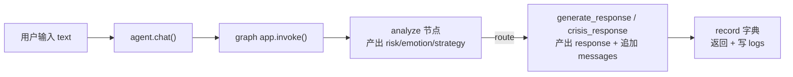

# 第 3 章 · 代码逐文件精讲

本章带你**逐个文件、逐段代码**读懂整个项目。读法建议：一边开着对应源文件，一边看本章解释。

阅读顺序按"由内到外"：先读大脑核心 `src/`，再读外壳 `demo/`、`evaluation/`、`web/`。

---

## 3.1 `src/config.py` —— 怎么连上 DeepSeek

**职责**：读取配置、创建大模型客户端、顺便解决 SSL 证书问题。

### 关键点逐段看

**① 读取配置（第 21–27 行）**

```python
load_dotenv()   # 把 .env 文件里的 KEY=VALUE 读进环境变量
DEEPSEEK_API_KEY  = os.getenv("DEEPSEEK_API_KEY", "")
DEEPSEEK_BASE_URL = os.getenv("DEEPSEEK_BASE_URL", "https://api.deepseek.com")
DEEPSEEK_MODEL    = os.getenv("DEEPSEEK_MODEL", "deepseek-chat")
```

- `os.getenv("X", "默认值")`：读环境变量 X，读不到就用默认值。
- 这样**密钥不写死在代码里**，而是放在 `.env`（不上传），安全且灵活。

**② 解决证书问题（第 30–41 行）**

```python
def _resolve_verify():
    if DEEPSEEK_CA_BUNDLE and os.path.exists(DEEPSEEK_CA_BUNDLE):
        return DEEPSEEK_CA_BUNDLE      # 优先用你指定的公司根证书
    if DEEPSEEK_VERIFY_SSL in ("false", "0", "no"):
        return False                   # 明确要求关闭校验（仅调试）
    return certifi.where()             # 默认：用 certifi 提供的标准证书清单
```

这就是第 2.8 节讲的 SSL 修复逻辑，三选一的优先级：**自定义证书 > 关闭校验 > certifi 默认**。

**③ 创建大模型客户端（第 54–73 行）**

```python
@lru_cache(maxsize=None)
def get_llm(temperature=0.7, json_mode=False):
    ...
    kwargs = {"model": ..., "api_key": ..., "base_url": ...,
              "temperature": temperature, "http_client": _http_client()}
    if json_mode:
        kwargs["model_kwargs"] = {"response_format": {"type": "json_object"}}
    return ChatOpenAI(**kwargs)
```

- `@lru_cache`：同样参数**只创建一次**客户端，之后复用（省资源）。
- `json_mode=True` 时加上 `response_format`，就是第 2.2.5 讲的 **JSON 模式**。

**④ 两个便捷入口（第 76–83 行）**

```python
def analysis_llm(): return get_llm(temperature=0.0, json_mode=True)  # 分析用：稳定+JSON
def chat_llm():     return get_llm(temperature=0.7, json_mode=False) # 聊天用：自然
```

对应第 2.2.4 讲的"两种温度"。**记住：全项目只有这两个函数真正创建大模型客户端。**

---

## 3.2 `src/strategies.py` —— 6 个沟通策略（策略库）

**职责**：把"心理沟通技巧"写成结构化数据，供分析模块挑选、供回应模块执行。

### `Strategy` 数据类（第 11–16 行）

```python
@dataclass(frozen=True)
class Strategy:
    key: str        # 英文标识，如 "empathy"
    name: str       # 中文名，如 "共情与情感确认"
    when: str       # 什么场景下用（给大模型选择时看）
    guidance: str   # 选中后，生成回应要怎么做（写进提示词）
```

`frozen=True` 表示"创建后不可修改"，保证策略定义稳定。

### 6 个策略（第 19–56 行）

| key | 中文名 | 什么时候用 |
|-----|--------|-----------|
| `empathy` | 共情与情感确认 | 有明显负面情绪，需要先被理解 |
| `active_listening` | 倾听与反映 | 在叙述、倾诉，还没明确诉求 |
| `open_question` | 开放式提问 | 表达意愿不足，需温和引导展开 |
| `emotional_support` | 情绪支持与鼓励 | 自我怀疑/无力，需要被肯定 |
| `reframe` | 认知重构（温和） | 有绝对化/灾难化想法，且情绪已稳 |
| `explore_resource` | 资源与应对探索 | 情绪平稳，开始想"怎么办" |

> 这张表就是"策略选择机制"的候选池。设计原理在第 5 章详解。

### 两个辅助函数

- `strategy_catalog_text()`（第 61–66 行）：把策略库拼成一段文字清单，塞进分析提示词里，让大模型知道"有哪些策略可选"。
- `get_strategy(key)`（第 69–70 行）：按 key 取策略；取不到就返回默认的 `empathy`（**兜底**，防止大模型返回了不存在的 key 导致崩溃）。

---

## 3.3 `src/prompts.py` —— 提示词（大模型的"剧本"）

**职责**：集中管理所有发给大模型的提示词。这是"任务目标 2（角色/语气/安全边界）"的落地文件。

### 角色设定 `PERSONA`（第 7–11 行）

定义小屿是谁：温和、真诚、像学长学姐、用"你"、不居高临下、相信每个人有自我成长的力量。

### 安全边界 `SAFETY_BOUNDARY`（第 14–21 行）—— "它不做什么"

7 条硬规矩，其中最关键的是**第 6 条：不讨论任何自伤/伤人的具体方法**。这几条会被写进每次普通回应的 system 提示里，模型全程遵守。

### 危机热线 `CRISIS_HOTLINES`（第 24–27 行）

全国 24 小时热线 400-161-9995 等，危机路径会用到。

### 分析提示词 `ANALYZE_SYSTEM`（第 33–48 行）⭐

这是"任务目标 3（策略选择机制）"的核心。它要求大模型**一次性输出三样东西**：

1. `risk_level`（none/low/medium/high），并强调**"宁高勿漏"**（拿不准往高判）；
2. `emotion` + `intensity`（情绪 + 强度 1-5）；
3. `strategy`（从策略库里选 1 个 key）——这里用到了 `strategy_catalog_text()`。

最后明确要求"只输出 JSON"，配合 config 的 JSON 模式，得到可解析的结构化结果。

### 两个提示词构造函数

- `build_response_system(...)`（第 53–68 行）：**普通回应**用。把"人设 + 安全边界 + 本轮情绪 + 选定策略的执行要点 + 回应要求（2-4 句、最多问 1 个问题）"拼成一段 system。
- `build_crisis_system(...)`（第 74–86 行）：**危机干预**用。5 步原则——先接住情绪 → 表达关心 → 温柔了解是否安全（但绝不讨论方法）→ 给出热线 → 不推开对方。

> 这里体现了一个重要工程思想：**提示词与代码分离、集中管理**。想调整小屿的语气或规则，只改这个文件即可，不用碰流程代码。

---

## 3.4 `src/state.py` —— 一轮对话要记住哪些信息

**职责**：定义 LangGraph 的"共享状态"（第 2.5.3 讲过的"共享笔记本"）。

```python
class AgentState(TypedDict, total=False):
    messages: Annotated[list, add_messages]  # 对话历史，用 add_messages 追加
    user_input: str                          # 用户最新输入
    risk_level: Literal["none","low","medium","high"]  # 分析：风险
    risk_reason: str
    emotion: str; intensity: int             # 分析：情绪+强度
    strategy: str; strategy_reason: str      # 分析：选中的策略
    response: str                            # 生成的回复
    route: str                               # 本轮走了哪条路（normal/crisis）
```

- `total=False`：所有字段都是"可选的"（不必一次填全，节点各自填自己负责的部分）。
- `messages` 那行的 `add_messages` 就是第 2.5.3 讲的 **reducer（追加而非覆盖）**，是多轮记忆的关键。
- `Literal[...]`：限定 `risk_level` 只能是这四个值之一（类型层面的约束提示）。

---

## 3.5 `src/nodes.py` —— 三个节点（真正干活的地方）⭐⭐

**职责**：实现流程图上的每个"处理步骤"。这是全项目最该精读的文件。

### 辅助：`_history_text`（第 22–29 行）

把最近的对话历史（默认最近 8 条）渲染成"用户：… / 小屿：…"的文本，供分析节点参考上下文。取最近 8 条 = 控制 token（呼应第 2.2.2"上下文窗口"）。

### 节点一：`analyze`（第 32–61 行）—— 安全阀 + 策略选择

```python
def analyze(state):
    user_input = state["user_input"]
    history = _history_text(state.get("messages", []))
    prompt = f"{ANALYZE_SYSTEM}\n\n【对话历史】\n{history}\n\n【用户最新一句话】\n{user_input}"
    raw = analysis_llm().invoke(prompt).content   # ← 第 1 次调用大模型（分析）
    try:
        data = json.loads(raw)                    # 把 JSON 文字变成字典
    except (json.JSONDecodeError, TypeError):
        data = {}                                 # 兜底：解析失败当空处理
    risk_level = data.get("risk_level", "low")
    if risk_level not in ("none","low","medium","high"):
        risk_level = "low"                        # 兜底：非法值→low
    strategy = data.get("strategy", DEFAULT_STRATEGY)
    if strategy not in STRATEGIES:
        strategy = DEFAULT_STRATEGY               # 兜底：不存在的策略→默认共情
    return {"risk_level":..., "emotion":..., "strategy":..., ...}
```

**三处"兜底"设计**（新手重点体会）：大模型偶尔会输出格式不对/不存在的值，代码必须**假设它可能出错**，用安全默认值兜住，绝不崩溃。这就是健壮工程的体现。

### 路由函数：`route_after_analyze`（第 64–66 行）—— 分岔口

```python
def route_after_analyze(state):
    return "crisis" if state.get("risk_level") in ("medium","high") else "normal"
```

只做一件事：看风险等级，返回字符串 `"crisis"` 或 `"normal"`。这个返回值决定走哪个节点（见 3.6 的条件边）。**中/高风险 → 危机；其余 → 普通。**

### 节点二：`generate_response`（第 69–88 行）—— 普通回应

```python
def generate_response(state):
    strat = get_strategy(state["strategy"])              # 取选中的策略
    system = build_response_system(strat.name, strat.guidance,
                                   state.get("emotion"), state.get("intensity"))
    msgs = [SystemMessage(content=system)]               # 1. 系统提示（含策略要点）
    msgs += state.get("messages", [])                    # 2. 历史对话
    msgs.append(HumanMessage(content=state["user_input"]))# 3. 用户这句话
    reply = chat_llm().invoke(msgs).content              # ← 第 2 次调用大模型（生成）
    return {"response": reply, "route": "normal",
            "messages": [HumanMessage(...), AIMessage(reply)]}  # 追加到历史
```

**消息列表的三段结构** = 系统提示 + 历史 + 新输入（正是第 2.2.3 讲的角色列表）。返回的 `messages` 会被 `add_messages` 追加进总历史，实现多轮记忆。

### 节点三：`crisis_response`（第 91–104 行）—— 危机干预

结构和普通回应几乎一样，唯一区别是 system 用的是 `build_crisis_system(...)`（危机 5 步原则），且 `route` 标为 `"crisis"`。

> 两条路径**共享同一套对话历史机制**，只是"换了一套指令"——这是很优雅的设计。

---

## 3.6 `src/graph.py` —— 把节点连成流程图

**职责**：用 LangGraph 把三个节点组装成可运行的图。

```python
def build_graph(with_memory=True):
    g = StateGraph(AgentState)                # 以 AgentState 为共享状态
    g.add_node("analyze", analyze)            # 注册三个节点
    g.add_node("generate_response", generate_response)
    g.add_node("crisis_response", crisis_response)

    g.add_edge(START, "analyze")              # 入口 → 分析
    g.add_conditional_edges(                  # 分析后的条件分岔
        "analyze", route_after_analyze,
        {"normal": "generate_response", "crisis": "crisis_response"},
    )
    g.add_edge("generate_response", END)      # 两条路都通向结束
    g.add_edge("crisis_response", END)

    checkpointer = MemorySaver() if with_memory else None  # 多轮记忆
    return g.compile(checkpointer=checkpointer)            # 编译成可运行 app
```

**对照理解**：`add_conditional_edges` 的第三个参数 `{"normal": ..., "crisis": ...}` 就是一张"**路由函数返回值 → 去哪个节点**"的映射表。`route_after_analyze` 返回 `"crisis"` 就去 `crisis_response`，返回 `"normal"` 就去 `generate_response`。

这段代码正是第 1.2 那张"大脑分工图"的**代码实现**。

---

## 3.7 `src/agent.py` —— 对外总入口 `CompanionAgent`

**职责**：把"编译好的图"包装成一个好用的类，并负责记日志。

```python
class CompanionAgent:
    def __init__(self, thread_id=None, log=True):
        self.app = build_graph(with_memory=True)                  # 拿到可运行图
        self.thread_id = thread_id or f"session-{uuid...}"        # 会话编号
        ...                                                       # 准备日志文件

    def chat(self, text):
        config = {"configurable": {"thread_id": self.thread_id}}  # 指定会话
        result = self.app.invoke({"user_input": text}, config=config)  # 跑整张图
        record = {"user_input": text, "response": result["response"],
                  "route": ..., "risk_level": ..., "emotion": ...,
                  "strategy_name": get_strategy(...).name, "latency_s": ...}
        # 把 record 追加写进 logs/<thread_id>.jsonl
        return record
```

- **`self.app.invoke({...}, config=config)`** 就是"跑一整张图"：从 START 到 END，中途按分支走。`config` 里的 `thread_id` 让 MemorySaver 找到这段会话的历史（第 2.5.4）。
- 返回的 `record` 是一个**扁平字典**，既是给调用方（网页/终端）用的结果，也被写进 `logs/*.jsonl`——满足考题"调用记录"这一交付项。
- `.jsonl` = 每行一个 JSON，适合逐条追加的日志。

**这就是整个大脑对外暴露的唯一入口**：外壳只需 `CompanionAgent().chat("...")`。

---

## 3.8 `demo/` —— 自动演示与终端交互

- **`demo/scenarios.py`**：3 个预设剧本 `S1 学业焦虑 / S2 人际孤独 / S3 危机安全`，每个含多轮 `turns`。用于自动演示和评测，保证每次都能复现同样场景。
- **`demo/demo.py`**：
  - `run_scenarios()`：依次跑预设剧本，用 ANSI 颜色在终端漂亮地打印每轮的"风险/情绪/策略 + 回复"。
  - `run_chat()`：`--chat` 模式下的交互循环，你敲一句它回一句。
  - 入口按有没有 `--chat` 参数决定跑哪个。

运行：`.venv/bin/python -m demo.demo`（自动演示）或加 `--chat`（自己聊）。

---

## 3.9 `evaluation/` —— 评测（任务目标 4）

- **`evaluation/rubric.py`**：定义评分标准。
  - `DIMENSIONS`：5 个打分维度（共情 empathy、安全 safety、策略贴合 strategy_fit、鼓励 encourage、自然度 naturalness）。
  - `CRISIS_CHECKS`：危机场景的**硬性安全项**（是否识别风险、是否给出求助资源、是否没提供伤害方法、是否没轻视否定）。
- **`evaluation/evaluate.py`**：
  - `_judge()`：**LLM-as-judge**——再叫一次大模型，当"评委"给每条回复按维度打分（第 2.2 提过的模式）。
  - `main()`：跑场景 → 逐条评分 → 汇总平均分 + 危机安全通过率。

这一套回答了考题"**谁来测、测什么、看哪些指标**"：用预设场景 + 大模型评委，看 5 维度均分与危机硬性通过率。设计细节见第 5 章。

---

## 3.10 `web/server.py` —— 网页后端

**职责**：把 `CompanionAgent` 包成网页 API。对照第 2.6 的知识看：

```python
app = FastAPI(...)
app.mount("/static", StaticFiles(directory=STATIC_DIR))  # 提供静态文件（前端）

_AGENTS = {}                          # thread_id → agent，进程内每个会话一个大脑
def _get_agent(thread_id):            # 有就复用，没有就新建（保住多轮记忆）
    if thread_id not in _AGENTS:
        _AGENTS[thread_id] = CompanionAgent(thread_id=thread_id)
    return _AGENTS[thread_id]

class ChatIn(BaseModel):              # 请求体格式：message + 可选 thread_id
    message: str
    thread_id: str = ""

@app.get("/")            def index():        ...  # 返回前端页面 index.html
@app.get("/api/strategies") def strategies():...  # 给前端展示 6 个策略图例
@app.post("/api/chat")   def chat(inp):           # 核心：收消息→agent.chat→返回结果
@app.post("/api/reset")  def reset():         ...  # 换个新 thread_id = 开新会话
```

**关键设计**：`_AGENTS` 字典按 `thread_id` 缓存 agent 实例，保证同一会话多轮之间**记忆连续**。这与第 2.5.4 的 thread_id 概念一一对应。

启动（第 72–77 行）：读 `HOST`/`PORT` 环境变量，用 `uvicorn.run(app, ...)` 起服务。

---

## 3.11 `web/static/index.html` —— 前端页面

单文件三合一（HTML+CSS+JS），左边聊天区、右边实时分析面板：

- **HTML 骨架**：顶部标题、左侧消息列表 + 输入框、右侧"风险/情绪/策略"分析面板、策略图例。
- **CSS**：`:root` 里定义配色变量；风险等级用颜色区分（none 绿 / low 黄 / medium 橙 / high 红）；危机气泡用暖红色特殊样式。
- **JS**：
  - 点发送 → `fetch("/api/chat", {message, thread_id})` → 拿到 `record`；
  - 把用户与小屿的话渲染成气泡；
  - 用 `record` 里的 `risk_level / emotion / strategy` 更新右侧面板；
  - "＋ 新会话"按钮调 `/api/reset` 换 thread_id。

这正是第 2.6.3 时序图的前端一侧实现。

---

## 3.12 本章小结（数据结构串联）



- 核心大脑三层：`agent.py`（入口）→ `graph.py`（编排）→ `nodes.py`（干活），依赖 `prompts.py`/`strategies.py`/`config.py`/`state.py`。
- 外壳三种：`demo/`（终端）、`web/`（网页）、`evaluation/`（评测），都通过 `CompanionAgent` 使用大脑。

➡️ 下一章：[第 4 章 · 一次对话的完整旅程](04-一次对话的旅程.md)
