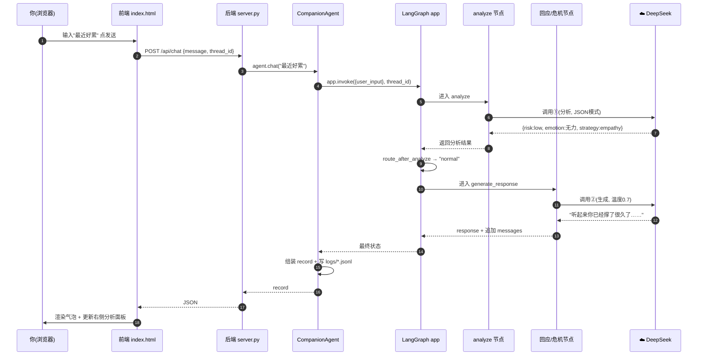
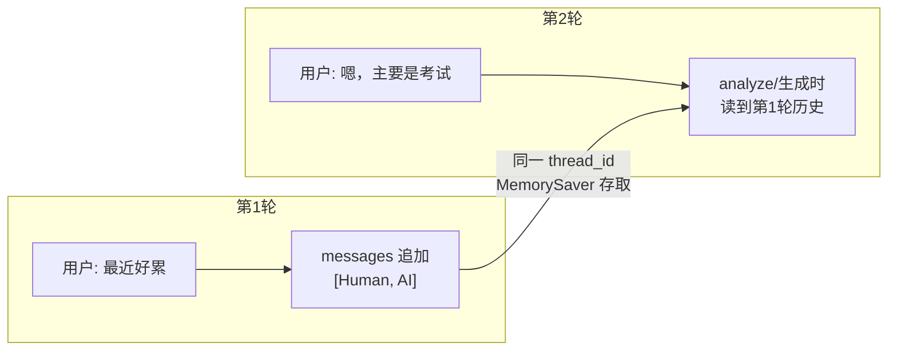

# 第 4 章 · 一次对话的完整旅程

前面几章拆开讲了各个零件。本章把它们**串起来**：从你在网页上敲下一句话，到看见小屿的回复，中间每一步到底发生了什么。我们用两个具体例子走一遍——一个普通场景、一个危机场景。

---

## 4.1 全景时序图（先看总览）



**一句话总结**：每轮对话，`app.invoke` 会先跑 analyze（第 1 次调用大模型），再按风险分岔跑回应或危机节点（第 2 次调用大模型），最后把结果打包成 record 返回并存档。**一轮 = 2 次大模型调用。**

---

## 4.2 例子 A：普通场景（低风险）

**你说**：`"最近好累，感觉怎么努力都没用"`

### 步骤① 前端发请求
`index.html` 的 JS 执行：
```javascript
fetch("/api/chat", {
  method: "POST",
  headers: {"Content-Type": "application/json"},
  body: JSON.stringify({ message: "最近好累，感觉怎么努力都没用", thread_id: 当前会话id })
})
```

### 步骤② 后端接收（server.py）
`chat(inp)` 被调用 → 用 `thread_id` 从 `_AGENTS` 找到（或新建）这个会话的 `CompanionAgent` → 调 `agent.chat("最近好累…")`。

### 步骤③ 进入图（agent.py → graph）
`app.invoke({"user_input": "最近好累…"}, config={thread_id})`。
LangGraph 从 `START` 出发，第一站是 `analyze`。此时 MemorySaver 会把这个 thread 之前的 `messages` 历史一并带进状态。

### 步骤④ analyze 节点（第 1 次大模型调用）
- 拼提示词：`ANALYZE_SYSTEM` + 对话历史 + 用户这句话。
- `analysis_llm().invoke(prompt)`（温度 0 + JSON 模式）。
- DeepSeek 返回类似：
```json
{"risk_level":"low","risk_reason":"表达疲惫和无力，但无伤害意图",
 "emotion":"无力","intensity":4,"strategy":"empathy","strategy_reason":"需要先被理解接纳"}
```
- `json.loads` 解析成字典；三处兜底校验通过；返回写入状态。

### 步骤⑤ 路由（route_after_analyze）
`risk_level = "low"` → 不在 `("medium","high")` → 返回 `"normal"`。
条件边查映射表 `{"normal": "generate_response"}` → 下一站是 `generate_response`。

### 步骤⑥ generate_response 节点（第 2 次大模型调用）
- `get_strategy("empathy")` 取到"共情与情感确认"策略。
- `build_response_system(...)` 拼出 system 提示（人设 + 安全边界 + 情绪=无力/强度4 + 共情要点 + 回应要求）。
- 组装消息列表：`[SystemMessage] + 历史 + HumanMessage("最近好累…")`。
- `chat_llm().invoke(msgs)`（温度 0.7）。
- DeepSeek 返回：`"听起来你已经撑了很久了，累到有点看不到回报……这种感觉真的很不好受。愿意和我说说，最近是什么事让你这么用力吗？"`
- 返回 `response` + `route="normal"` + 把这轮的 `HumanMessage/AIMessage` 追加进 `messages`。

### 步骤⑦ 到达 END，组装 record（agent.py）
```python
record = {
  "user_input": "最近好累…", "response": "听起来你已经撑了很久了……",
  "route": "normal", "risk_level": "low", "emotion": "无力", "intensity": 4,
  "strategy": "empathy", "strategy_name": "共情与情感确认", "latency_s": 3.1, ...
}
```
写进 `logs/<thread_id>.jsonl` 一行。

### 步骤⑧ 返回前端并渲染
- 左侧出现小屿的气泡；
- 右侧面板：风险徽标显示绿色"low"，情绪显示"无力 4/5"，策略显示"共情与情感确认"。

✅ 一轮结束。你再说下一句时，因为 `thread_id` 不变，第④、⑥步都能读到刚才这轮的历史，实现**连续对话**。

---

## 4.3 例子 B：危机场景（高风险）

**你说**：`"我觉得活着没有任何意义了"`

前四步与例子 A 相同，差别从 analyze 结果开始：

### analyze 返回（第 1 次调用）
```json
{"risk_level":"high","risk_reason":"出现活着没有意义的绝望表达，需最高警惕",
 "emotion":"绝望","intensity":5,"strategy":"empathy","strategy_reason":"..."}
```
（注意：危机时 strategy 会被后续流程忽略，因为不走普通回应。）

### 路由：走危机
`route_after_analyze` 看到 `risk_level="high"` ∈ `("medium","high")` → 返回 `"crisis"` → 条件边导向 `crisis_response`。

### crisis_response 节点（第 2 次调用）
- `build_crisis_system("high")` 拼出**危机 5 步原则**的 system 提示。
- 同样组装 `[SystemMessage] + 历史 + HumanMessage`，`chat_llm().invoke(...)`。
- DeepSeek 返回一段：先稳稳接住情绪 → 表达在乎 → 温柔询问是否安全 → **给出 400-161-9995 等热线** → 不推开对方。
- `route="crisis"`。

### 前端渲染
- 小屿的气泡用**暖红色**特殊样式（前端根据 `route==="crisis"` 或高风险着色）；
- 右侧风险徽标显示**红色"high"**。

✅ 这就是"安全阀"生效的完整链路：**危险信号在 analyze 就被拦下，直接改走危机通道，而不是照常闲聊。**

---

## 4.4 多轮记忆是怎么"接上"的？



- 每个节点返回的 `messages`（本轮的 Human+AI）经 `add_messages` **追加**进状态。
- MemorySaver 按 `thread_id` 把状态存下来。
- 下一轮 `invoke` 时，同一 `thread_id` 会把历史**取回来**，拼进提示词——于是小屿"记得"你上一句说了什么。
- 点"＋ 新会话" = 换 `thread_id` = MemorySaver 里另起一段，历史清零。

---

## 4.5 亲手观察这段旅程

想真正"看见"上面的流程，做两件事：

1. **看日志**：跑几轮后打开 `logs/` 里对应的 `.jsonl`，每行就是一轮的完整 record，能看到 risk/emotion/strategy/route。
2. **看终端演示**：`.venv/bin/python -m demo.demo`，它会把每轮的分析和回复彩色打印出来，等于把本章的旅程可视化。

> 💡 想更深入：在 `nodes.py` 的 `analyze` 里临时加一行 `print("分析结果:", data)`，再跑一次，你就能亲眼看到大模型返回的原始 JSON。看完记得删掉。

---

## 4.6 本章小结

- 一轮对话 = `analyze`（调用①，判断）→ 路由 → `generate_response` 或 `crisis_response`（调用②，回应）→ 打包 record。
- **风险优先**：任何输入先过 analyze 这道闸门再决定走哪条路。
- **多轮记忆**靠 `thread_id` + `MemorySaver` + `add_messages` 三者配合。

➡️ 下一章：[第 5 章 · 设计原理与领域知识](05-设计原理.md)
