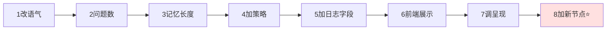

# 第 6 章 · 动手练习与扩展任务

看懂了不等于会写。本章给你 **8 个由易到难的练习**，每个都对应真实的改造需求。建议按顺序做——它们从"改一个字"逐步升级到"加一个新节点"。

> 🛟 **安全网**：动手前先备份，或者养成"改坏了能改回来"的意识。每个练习都标了**改哪个文件**和**怎么验证**。

---

## 练习 1（★ 入门）：改小屿的语气

**目标**：让小屿说话更活泼一点，多用一点点 emoji。

**改哪里**：[src/prompts.py](../../src/prompts.py) 的 `PERSONA`。

**怎么做**：在语气那一行后面加一句，例如：
```python
语气：口语化、平和、有温度；可以偶尔用一个温暖的 emoji（如 🌱、☕），但不要每句都用。
```

**验证**：`.venv/bin/python -m demo.demo`，看回复语气有没有变化。

**学到**：提示词（system）直接决定风格，改提示词不用动任何流程代码。

---

## 练习 2（★ 入门）：调整"最多问几个问题"

**目标**：让小屿一轮里可以问最多 2 个问题（原本是 1 个）。

**改哪里**：`prompts.py` 的 `build_response_system` 里"回应要求"那段。

**怎么做**：把"一轮最多问 1 个问题"改成"一轮最多问 2 个问题"。

**验证**：跑演示，观察提问密度。

**思考**：改完你会发现回复变得更"追问"了。体会第 5 章说的"连环追问会给人压力"——这就是为什么原设计限制为 1 个。

---

## 练习 3（★★ 基础）：改历史记忆的长度

**目标**：让分析节点参考最近 12 条历史（原本 8 条）。

**改哪里**：[src/nodes.py](../../src/nodes.py) 的 `_history_text(messages, limit: int = 8)`。

**怎么做**：把默认值 `8` 改成 `12`。

**验证**：多聊几轮涉及前文的话题（"我刚才说的那件事…"），看小屿是否记得更久。

**学到**：token 成本与"记性"是权衡关系。历史越长越"记得住"，但每次调用更贵、更慢。

---

## 练习 4（★★ 基础）：新增一个沟通策略

**目标**：加一个"幽默调节"策略 `humor`。

**改哪里**：[src/strategies.py](../../src/strategies.py) 的 `STRATEGIES` 字典。

**怎么做**：在字典里加一项：
```python
"humor": Strategy(
    key="humor",
    name="幽默与轻松化解",
    when="用户情绪不太重、关系已较放松，适度幽默能缓解紧绷。",
    guidance="用温和、善意的轻松口吻回应，绝不拿对方的痛苦开玩笑；点到为止。",
),
```

**验证**：
1. 因为 `strategy_catalog_text()` 会自动把新策略加进分析提示词，大模型立刻就能选它。
2. 跑演示，或直接说一句轻松的话，看日志里 `strategy` 会不会出现 `humor`。

**学到**：良好的数据驱动设计——**加能力只需加数据，不用改逻辑**。这是策略库设计的威力。

---

## 练习 5（★★★ 进阶）：在日志里增加一个字段

**目标**：给每条记录加上 `message_length`（用户输入的字数）。

**改哪里**：[src/agent.py](../../src/agent.py) 的 `chat()` 里组装 `record` 的地方。

**怎么做**：在 `record = {...}` 里加一行：
```python
"message_length": len(text),
```

**验证**：跑一轮，打开 `logs/*.jsonl`，确认每行多了 `message_length`。

**学到**：`record` 是"对外结果 + 存档"合一的结构，扩展它就能记录更多可分析的数据。

---

## 练习 6（★★★ 进阶）：给网页加一个"查看本轮策略理由"

**目标**：把 `strategy_reason`（大模型给的选策略理由）显示到网页右侧面板。

**改哪里**：[web/static/index.html](../../web/static/index.html) 的 JS（渲染分析面板的部分）。

**怎么做**：
1. `record` 里本来就有 `strategy_reason`（见 agent.py），后端已经返回。
2. 在前端更新面板的函数里，找到显示 strategy 的地方，追加一行显示 `record.strategy_reason`。

**验证**：刷新网页，聊一句，看面板是否出现"选择该策略的理由"。

**学到**：前后端数据是打通的——后端已经给的数据，前端加几行就能展示。观察 `record` 里还有哪些字段没用上。

---

## 练习 7（★★★★ 挑战）：调整危机判定的灵敏度

**目标**：让 `medium` 风险也能在网页上更醒目地提示（比如让 medium 也走暖色气泡）。

**改哪里**：前端 `index.html`（着色逻辑）。**不要**改 `route_after_analyze`——medium 本来就已经走危机路径了（见 nodes.py 第 66 行）。

**怎么做**：找到前端根据风险/route 着色的代码，把 medium 也纳入"暖红"或"橙"高亮。

**验证**：构造一句 medium 级的话（强烈无助但无明确计划，如"我觉得好绝望，什么都没意义"），看气泡颜色。

**学到**：分清"**流程判定**"（后端 route）和"**视觉呈现**"（前端着色）是两件事。这个练习只动呈现，不动安全逻辑——**安全逻辑要慎改**。

---

## 练习 8（★★★★★ 高手）：加一个全新节点"结束语/资源卡"

**目标**：在普通回应之后，如果检测到用户情绪强度很低（说明快聊完/平复了），额外附一句温暖的收尾。

**这是真正的 LangGraph 练习**，涉及加节点 + 改图：

**步骤**：
1. **加节点**：在 [src/nodes.py](../../src/nodes.py) 写一个新函数，例如：
```python
def closing_note(state):
    # 简单示例：不调用大模型，直接追加一句固定收尾
    note = "如果需要，我随时都在。也别忘了，累了就好好休息一下 🌱"
    return {"response": state.get("response", "") + "\n\n" + note}
```
2. **改图**：在 [src/graph.py](../../src/graph.py) 里：
   - `g.add_node("closing_note", closing_note)`
   - 把 `generate_response` 原本连到 `END` 的边，改成先连到 `closing_note`，再由 `closing_note → END`。
   - （进阶）用条件边：只有 `intensity <= 2` 才走 `closing_note`，否则直接 `END`。

**验证**：跑演示，看低强度回复末尾是否多了收尾语。

**学到**：这是把第 2.5、3.6 学的"节点 + 边 + 条件边"真正用起来。你会体会到 **LangGraph 的可扩展性——加一个处理步骤，就是加一个节点 + 连几条边**。

---

## 6.9 练习难度总览



| # | 难度 | 主要文件 | 核心收获 |
|---|------|---------|---------|
| 1 | ★ | prompts.py | 提示词决定风格 |
| 2 | ★ | prompts.py | 回应约束的意义 |
| 3 | ★★ | nodes.py | 记忆与成本权衡 |
| 4 | ★★ | strategies.py | 数据驱动扩展 |
| 5 | ★★★ | agent.py | record 结构 |
| 6 | ★★★ | index.html | 前后端数据打通 |
| 7 | ★★★★ | index.html | 流程判定 vs 视觉呈现 |
| 8 | ★★★★★ | nodes.py + graph.py | LangGraph 加节点改图 |

---

## 6.10 改坏了怎么办？

- **语法错误**：跑的时候会报 `SyntaxError` 并指出行号，回去看那一行。
- **改完没效果**：确认你改的是 `.venv/bin/python` 实际运行的那个文件；网页记得刷新（甚至强制刷新）。
- **想还原**：如果这个项目用 git 管理，`git diff` 看改动、`git checkout <文件>` 还原。没有 git 就靠你改前的备份。
- 更多排错见下一章。

➡️ 下一章：[第 7 章 · FAQ、调试技巧与名词表](07-FAQ与名词表.md)
