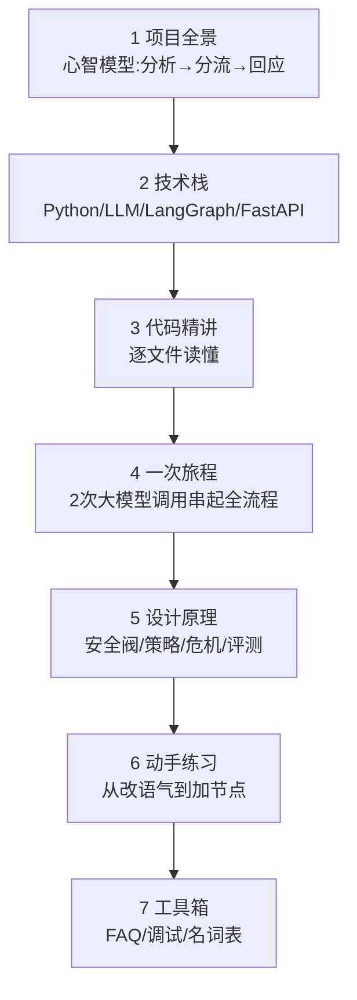

# 第 7 章 · FAQ、调试技巧与名词表

最后一章是"工具箱"：遇到报错怎么办、怎么调试、以及一份中英文名词速查表。建议**遇到问题时回来翻**。

---

## 7.1 常见报错与解决

### ① `CERTIFICATE_VERIFY_FAILED: unable to get local issuer certificate`

**含义**：程序访问 DeepSeek 时验证不了 HTTPS 证书（第 2.8 节）。

**解决**：本项目已用 `certifi` 默认修复。若在**公司代理网络**下仍报错，在 `.env` 里二选一：
```bash
DEEPSEEK_CA_BUNDLE=/绝对路径/公司根证书.pem   # 推荐：指定公司根证书
# 或（仅本地调试、不安全）
DEEPSEEK_VERIFY_SSL=false
```

### ② `RuntimeError: 未检测到 DEEPSEEK_API_KEY，请在 .env 中配置`

**含义**：没读到 API Key（config.py 第 60–61 行主动抛的）。

**解决**：确认项目根目录有 `.env` 文件，里面有 `DEEPSEEK_API_KEY=sk-...`；确认你是在项目根目录运行命令。

### ③ `ModuleNotFoundError: No module named 'langgraph'`（或 fastapi 等）

**含义**：依赖没装，或没用对 Python。

**解决**：
```bash
.venv/bin/pip install -r requirements.txt   # 装依赖
.venv/bin/python -m demo.demo               # 用 .venv 里的 python 运行
```
**关键**：一定用 `.venv/bin/python`，不要用系统的 `python`。

### ④ `ModuleNotFoundError: No module named 'src'`

**含义**：运行方式不对，Python 找不到包。

**解决**：用 `-m` 模块方式在**项目根目录**运行，如 `python -m demo.demo`、`python -m web.server`，而不是 `python demo/demo.py`。

### ⑤ 网页打不开 / `Address already in use`（端口被占）

**含义**：8000 端口已被占用（可能上次的服务器还在跑）。

**解决**：换端口 `PORT=8010 .venv/bin/python -m web.server`，或先关掉占用端口的旧进程。

### ⑥ IDE 提示"Package X is not installed in the selected environment"

**含义**：这是 **IDE 选的解释器**不是我们的 `.venv`，**不影响命令行运行**。

**解决**：忽略即可；或在 IDE 里把解释器切换到项目的 `.venv/bin/python`。

### ⑦ 回复很慢 / 偶尔超时

**含义**：一轮要调用 2 次云端大模型，受网络与服务端影响。

**解决**：属正常波动；config 里已设 `timeout=60` 和 `max_retries=2`（失败自动重试）。持续超时则检查网络/代理。

---

## 7.2 调试技巧（新手最该学的几招）

### 招式 1：`print` 大法
最简单直接。想知道某个变量长什么样，就在那行后面加：
```python
print(">>> 分析结果:", data)      # 看大模型返回的原始判断
```
跑一次看输出，看完删掉。放在 [nodes.py](../../src/nodes.py) 的 `analyze` 里最有用。

### 招式 2：看日志文件
`logs/*.jsonl` 每行记录了一轮的完整信息（风险/情绪/策略/route/耗时）。回复"不对劲"时，先看日志里 analyze 判断成了什么——**很多问题出在分析阶段判错**。

### 招式 3：读报错的最后几行
Python 报错（Traceback）**最后一行**才是真正的错误类型和信息，倒数第二段告诉你**哪个文件哪一行**出的错。别被前面一大堆吓到，从下往上读。

### 招式 4：缩小范围
不确定问题在哪时，用"二分"思路：在流程中间加 `print`，看数据到这里还对不对，逐步逼近出错的那一段。

### 招式 5：单独测一个函数
新建一个临时脚本，只调用你怀疑的函数：
```python
from src.strategies import get_strategy
print(get_strategy("empathy").name)   # 单独验证这个函数对不对
```

---

## 7.3 高频疑问 FAQ

**Q：小屿的"智能"到底是我写的，还是 DeepSeek 的？**
A：**语言生成能力来自 DeepSeek**（云端大模型）；而"先分析再回应、危机分流、策略选择、安全边界"这套**行为框架是本项目代码定义的**。你写的是"怎么组织和约束这个大模型"，这正是 AI 应用开发的核心。

**Q：换成别的大模型（如通义、豆包）可以吗？**
A：只要对方提供 **OpenAI 兼容接口**，改 `.env` 里的 `DEEPSEEK_BASE_URL` / `DEEPSEEK_MODEL` / `DEEPSEEK_API_KEY` 即可，代码基本不用动（第 2.3.2）。

**Q：多轮记忆存在哪？关掉程序还在吗？**
A：存在 `MemorySaver`（内存里），**程序一关就没了**。想持久化，可换成基于数据库的 checkpointer（属进阶扩展）。

**Q：为什么危机场景大模型也判过策略，却没用上？**
A：analyze 一次性把风险+情绪+策略都算了，但路由发现是 medium/high 就直接走危机节点，策略字段在这条路上被忽略（第 4.3）。这是"一次分析、按需取用"的取舍。

**Q：这个能上线给真人用吗？**
A：**不能直接上线**。它是课程原型，README 有免责声明。真实心理产品需要专业机构参与、合规审查、真人危机干预兜底等，远超本项目范围。

**Q：`.env` 能上传到 GitHub 吗？**
A：**绝对不能**。里面有 API Key（等于钱包）。项目用 `.gitignore` 排除了它，上传前务必确认。

---

## 7.4 名词表（中英对照速查）

| 术语 | 英文 | 一句话解释 |
|------|------|-----------|
| 大语言模型 | LLM (Large Language Model) | 会"文字接龙"的 AI，如 DeepSeek |
| 提示词 | Prompt | 发给大模型的输入文字 |
| 词元 | Token | 大模型处理文字的最小单位，按它计费 |
| 系统提示 | System Prompt | 定人设和规则的那条消息 |
| 温度 | Temperature | 控制输出随机性，0=稳定、高=发散 |
| 上下文窗口 | Context Window | 模型一次能看的最大 token 数 |
| JSON 模式 | JSON Mode | 强制模型只输出 JSON，便于程序解析 |
| 接口 | API | 按约定格式发请求、收数据的通道 |
| 密钥 | API Key | 调用大模型的身份令牌（`sk-...`），保密 |
| 状态图 | StateGraph | LangGraph 里"带状态的流程图" |
| 状态 | State | 各节点共享读写的"笔记本"（`AgentState`） |
| 节点 | Node | 流程图上的一个处理步骤（一个函数） |
| 边 | Edge | 节点之间的连线，定下一步去哪 |
| 条件边 | Conditional Edge | 按状态动态选下一个节点（分岔） |
| 归约器 | Reducer | 合并状态更新的规则；`add_messages`=追加 |
| 检查点存储 | Checkpointer | 保存每轮状态，本项目用 `MemorySaver` |
| 会话编号 | thread_id | 区分是哪段连续对话（多轮记忆的钥匙） |
| 编译 | compile | 把图变成可运行的应用 `app` |
| 调用 | invoke | 真正"执行一次"（跑图 / 调大模型） |
| 大模型评委 | LLM-as-judge | 用大模型给回复自动打分的评测法 |
| 虚拟环境 | venv | 项目专属的、隔离的 Python 环境 |
| 依赖 | dependencies | 项目用到的第三方库 |
| 后端 | Backend | 处理逻辑的服务器端（`server.py`） |
| 前端 | Frontend | 用户看到的界面（`index.html`） |
| 路由 | Route/Routing | 决定"下一步/请求去哪"的机制 |
| 兜底 | Fallback | 出错/异常时用的安全默认值 |

---

## 7.5 继续学习的方向

学完这份教程，如果你还想深入，推荐路线：

1. **深入 LangGraph**：官方文档里的循环图、并行节点、人类介入（human-in-the-loop）、流式输出。
2. **持久化记忆**：把 `MemorySaver` 换成数据库版 checkpointer，让记忆跨重启保留。
3. **RAG（检索增强）**：给小屿接入一个"心理知识库"，回答更专业（进阶）。
4. **前端框架**：把单文件 `index.html` 升级成 React/Vue 应用。
5. **评测体系**：扩充场景库、增加维度、引入真人评分对照 LLM 评分。

---

## 7.6 全教程回顾



你已经走完了从"这是什么"到"能动手改"的全过程。记住那条主线——**先分析、再分流、后回应，安全永远优先**——其余的细节，随时回来查。

祝你玩得开心，也希望「小屿」的设计思路，能让你对"负责任的 AI 应用"有一点自己的理解。🌱

⬅️ 返回：[教程首页](README.md)
