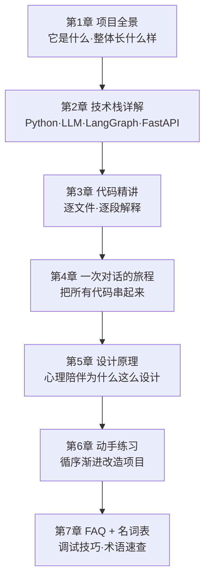

# 「小屿」心理陪伴智能体 · 从零学习教程

> 这份教程写给**编程新手 / 刚接触大模型应用的大学生**。
> 目标：读完后你能**看懂本项目的每一行代码、每一个技术选型的理由**，并能自己动手改造和扩展。

## 📖 怎么用这份教程

建议按顺序读；每章都尽量做到"先讲清概念，再对着代码讲"。遇到不懂的名词，先记下，第 7 章有名词表。

## 🗺️ 学习路线图

## 📚 章节目录

| 章 | 标题 | 你会学到 |
|----|------|---------|
| 1 | [项目全景与心智模型](01-项目全景.md) | 项目做什么、整体架构图、一次对话的数据流 |
| 2 | [技术栈详解](02-技术栈详解.md) | 虚拟环境、大模型/LLM 基础、LangChain、**LangGraph**、FastAPI、前端、SSL |
| 3 | [代码逐文件精讲](03-代码精讲.md) | `src/` 每个文件、`demo/`、`evaluation/`、`web/` 的每段代码 |
| 4 | [一次对话的完整旅程](04-一次对话的旅程.md) | 从你敲下一句话到看到回复，中间发生了什么 |
| 5 | [设计原理与领域知识](05-设计原理.md) | 6 个沟通策略、安全边界、危机干预背后的道理 |
| 6 | [动手练习与扩展任务](06-动手练习.md) | 8 个由易到难的改造练习 |
| 7 | [FAQ、调试技巧与名词表](07-FAQ与名词表.md) | 常见报错、如何调试、术语中英对照 |

## ✅ 前置知识（不会也没关系，边学边补）

- 会一点点 Python（变量、函数、字典、`import`）就够了；类、装饰器等本教程会解释。
- 知道"命令行 / 终端"怎么敲命令。
- **完全不需要**懂机器学习、神经网络——我们是"调用"大模型，不是"训练"大模型。

## 🧭 一句话记住这个项目

> 它是一个"**有安全阀 + 会选沟通策略**的聊天机器人"：每次你说话，它先**判断风险和情绪、挑一个沟通策略**，再据此**生成一句有温度的回应**；如果发现危机，就走另一条"危机干预"通道并给出求助热线。
